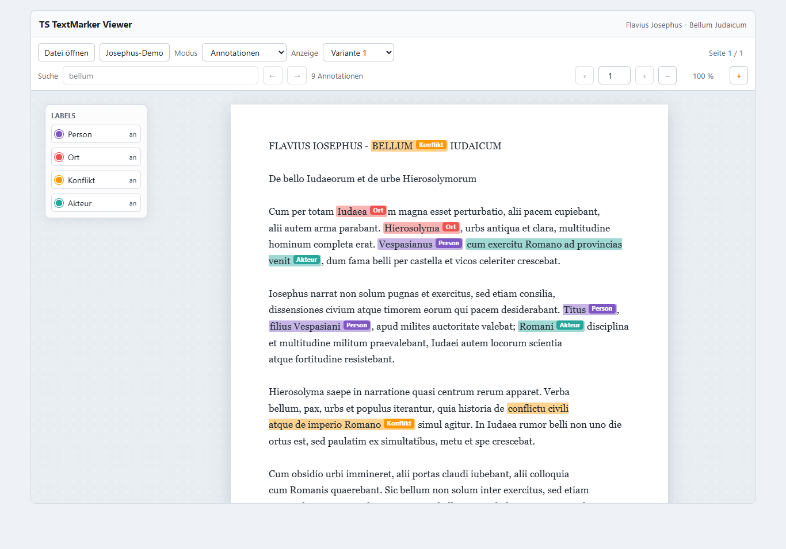
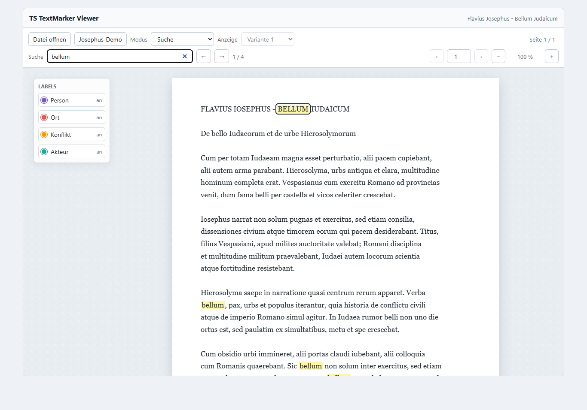
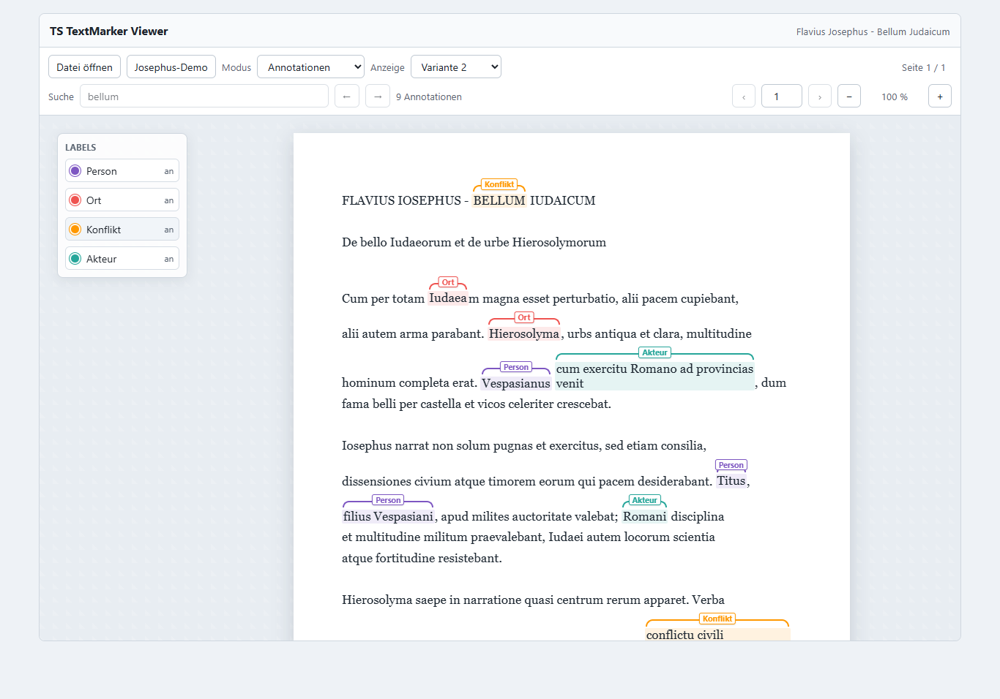
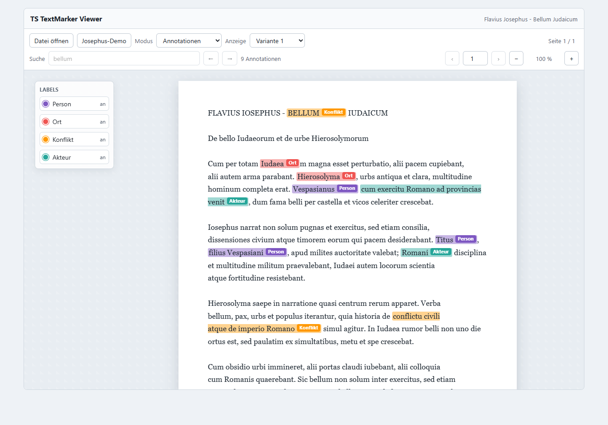

# TS_TextMarkerViewer



Framework-unabhaengige TypeScript-Web-Component zum Anzeigen von PDF- und TXT-Dokumenten mit Suche und read-only Annotationen.

Der Viewer basiert auf `TS_TextMarkerCore`. Das gemeinsame Datenmodell, Validierung, Label-Aufloesung und Text-Matching kommen aus `@datenflix007/ts-text-marker-core`. Der Viewer interpretiert dieses Modell und stellt es dar; er erstellt, veraendert, loescht und speichert keine Annotationen.

## Installation

Aktuell aus GitHub:

```bash
npm install github:Datenflix007/TS_TextMarkerViewer
```

`TS_TextMarkerCore` wird vom Viewer als Dependency installiert. Wenn ein Projekt Core-Typen direkt verwendet, koennen beide Repositories explizit installiert werden:

```bash
npm install github:Datenflix007/TS_TextMarkerCore
npm install github:Datenflix007/TS_TextMarkerViewer
```

Spaeter als npm-Package:

```bash
npm install @datenflix/ts-text-marker-viewer
```

## Grundverwendung

```html
<ts-text-marker-viewer id="viewer"></ts-text-marker-viewer>
```

```ts
import "@datenflix/ts-text-marker-viewer";
import type { TSTextMarkerViewer } from "@datenflix/ts-text-marker-viewer";

const viewer = document.querySelector<TSTextMarkerViewer>(
  "ts-text-marker-viewer"
);

await viewer?.loadText("bellum et pax", {
  id: "demo",
  title: "Demo",
  type: "txt"
});
```

## Core-Beispiel

```ts
import "@datenflix/ts-text-marker-viewer";

import type {
  AnnotationDocument
} from "@datenflix007/ts-text-marker-core";

const viewer = document.querySelector(
  "ts-text-marker-viewer"
);

const annotations: AnnotationDocument = {
  version: "1.0",

  document: {
    id: "demo",
    title: "Josephus Demo",
    type: "txt"
  },

  labels: [
    {
      id: "person",
      name: "Person",
      color: "#7e57c2"
    }
  ],

  annotations: [
    {
      id: "ann-1",
      labelId: "person",
      quote: "Vespasianus"
    }
  ]
};

await viewer?.loadText(
  "Vespasianus ...",
  annotations.document
);

viewer?.setAnnotationDocument(
  annotations
);
```

Labels liefern Anzeigename und Farbe. Annotationen referenzieren Labels ueber `labelId`; dadurch werden Farbe und Anzeigename nicht redundant in jeder Annotation gespeichert.

## Oeffentliche API

```ts
loadFile(file: File): Promise<void>;
loadText(text: string, metadata?: DocumentMetadata): Promise<void>;
setMode(mode: "search" | "annotations"): void;
setSearchTerm(term: string): void;
setAnnotationDocument(document: AnnotationDocument): void;
setAnnotationDisplayStyle(style: "inline" | "bracket"): void;
setAnnotationLabelVisibility(labelId: string, visible: boolean): void;
clearSearch(): void;
goToPage(page: number): void;
setZoom(zoom: number): void;
getCurrentPage(): number;
getPageCount(): number;
getZoom(): number;
getAnnotationDisplayStyle(): "inline" | "bracket";
getHiddenAnnotationLabelIds(): string[];
```

`DocumentMetadata` und `AnnotationDocument` kommen aus `@datenflix007/ts-text-marker-core`.

Die Web Component wird automatisch registriert:

```ts
if (!customElements.get("ts-text-marker-viewer")) {
  customElements.define("ts-text-marker-viewer", TSTextMarkerViewer);
}
```

## PDF Laden

```ts
await viewer?.loadFile(pdfFile);
```

PDFs werden mit `pdfjs-dist` als Canvas-Seiten gerendert. Das originale Layout bleibt sichtbar; Suche und Annotationen werden aus der vorhandenen Textschicht als Layer darueber gelegt. Reine Bildscans werden angezeigt, aber ohne OCR-Textschicht nicht durchsucht.

## TXT Laden

```ts
await viewer?.loadFile(txtFile);
```

oder direkt:

```ts
await viewer?.loadText("Vespasianus bellum narrat.", {
  id: "txt-demo",
  title: "TXT Demo",
  type: "txt"
});
```

TXT wird als Dokumentseite mit weissem Seitenhintergrund, Schatten, angenehmer Satzbreite und erhaltenen Absatzumbruechen dargestellt. Der Text bleibt selektierbar.

## Suche

```ts
viewer?.setMode("search");
viewer?.setSearchTerm("bellum");
```

Die Suche verwendet `findTextOccurrences` aus `@datenflix007/ts-text-marker-core`. Der Viewer markiert die Treffer neutral gelb, zeigt die Trefferzahl und erlaubt Navigation. Das `AnnotationDocument` bleibt dabei unveraendert.

## Annotationen

```ts
viewer?.setMode("annotations");
viewer?.setAnnotationDocument(annotationDocument);
viewer?.setAnnotationDisplayStyle("bracket");
viewer?.setAnnotationLabelVisibility("conflict", false);
```

`setAnnotationDocument` validiert das Dokument mit `validateAnnotationDocument` aus dem Core und wirft bei ungueltigen Daten eine lesbare Fehlermeldung.

Textpositionen werden mit `resolveAnnotationRange` aufgeloest. Labels werden mit `getAnnotationLabel` aufgeloest. Der Viewer erzeugt daraus nur ein internes Render-Modell fuer DOM- und PDF-Highlights.

Links neben dem Dokument zeigt der Viewer die Labels des `AnnotationDocument`. Ein Klick auf ein Label blendet alle Markierungen dieses Labels aus; das Label wird grau. Ein weiterer Klick blendet es wieder ein.

## Demo

Die Demo unter `demo/` ist wie eine Consumer-Anwendung aufgebaut. `demo/main.ts` importiert nur oeffentliche APIs:

```ts
import "@datenflix/ts-text-marker-viewer";
import type { AnnotationDocument } from "@datenflix007/ts-text-marker-core";
import type { TSTextMarkerViewer } from "@datenflix/ts-text-marker-viewer";
```

### Suchmodus



### Annotationen


### Annotationen Variante 2



### Dokumentansicht



Die Screenshots werden aus der echten Demo erzeugt:

```bash
npm run screenshots
```

## Architektur

```text
+--------------------------+
| TS_TextMarkerCore        |
|                          |
| AnnotationDocument       |
| Annotation               |
| Labels                   |
| Matching                 |
| Validation               |
+------------+-------------+
             |
             v
+--------------------------+
| TS_TextMarkerViewer      |
|                          |
| PDF / TXT                |
| Search                   |
| Highlighting             |
| Labels                   |
+--------------------------+
```

- `TS_TextMarkerCore` enthaelt das gemeinsame Datenmodell.
- `TS_TextMarkerViewer` interpretiert dieses Datenmodell und stellt es read-only dar.
- PDF-Rendering, Canvas, Text-Layer, Zoom, Navigation und Highlight-Overlay bleiben Viewer-spezifisch.
- Ein spaeterer `TS_TextMarkerEditor` kann ein `AnnotationDocument` pflegen und den Viewer mit `viewer.setAnnotationDocument(updatedDocument)` aktualisieren.

Weitere Details stehen in [docs/ARCHITECTURE.md](docs/ARCHITECTURE.md).

## Entwicklung

```bash
npm install
npm run lint
npm run build
npm test
npm run test:e2e
```

Mit `just`:

```bash
just install
just dev
just check
just screenshots
```

Die lokale Entwicklungsumgebung erwartet einen benachbarten Checkout von `../TS_TextMarkerCore`. Code und Demo importieren weiterhin den Package-Namen `@datenflix007/ts-text-marker-core`; `tsconfig` und Vite loesen diesen Namen lokal auf den Core-Checkout auf.
